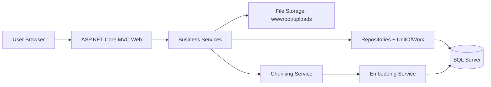
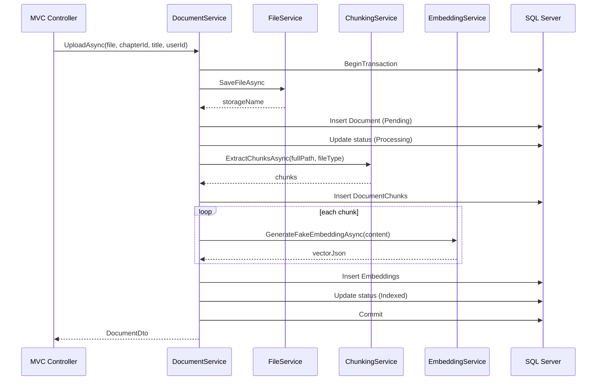

# Learning Document System (Assignment 1)

Learning Document System is a .NET 8 MVC application for managing study materials by subject and chapter. The system supports role-based access control, file upload (PDF/DOCX/PPTX), document chunking, simulated embedding generation, and indexing status tracking.

## Features

- Authentication and authorization with roles: `Admin`, `Teacher`, `Student`
- Subject and chapter management
- Document upload and storage
- Content extraction and chunking
- Simulated vector embedding generation for each chunk
- Document indexing status lifecycle: `Pending`, `Processing`, `Indexed`, `Failed`

## Tech Stack

- .NET 8, ASP.NET Core MVC
- Entity Framework Core 8 + SQL Server
- Cookie Authentication + Authorization Policies
- AutoMapper
- iText7 (PDF parsing)
- DocumentFormat.OpenXml (DOCX/PPTX parsing)

## Solution Structure

The solution uses a layered architecture with 3 main projects:

- `LearningDocumentSystem.Web`
  - Presentation layer (MVC): controllers, views, view models, middleware configuration
- `LearningDocumentSystem.Business`
  - Business layer: DTOs, services, mapping profiles
- `LearningDocumentSystem.Data`
  - Data layer: `DbContext`, entities, repositories, unit of work, migrations, seeding

## System Architecture

### Layered Design

- Presentation layer (`Web`)
  - Receives HTTP requests
  - Validates input models
  - Calls business services
  - Returns Razor views
- Business layer (`Business`)
  - Implements use-case logic
  - Orchestrates upload -> chunking -> embedding -> status updates
  - Maps entities and DTOs
- Data layer (`Data`)
  - Repository + Unit of Work abstractions
  - Transaction management
  - Persistence with EF Core and SQL Server

### High-Level Architecture Diagram



### Dependency Injection (Web)

The web project configures:

- `AddDbContext` with SQL Server
- Cookie authentication
- Authorization policies:
  - `AdminOnly`
  - `TeacherUp` (Admin or Teacher)
  - `AllUsers` (authenticated users)
- Session services
- AutoMapper
- Scoped repositories and business services
- Database seeder execution at startup

## Document Upload and Indexing Flow

`DocumentService.UploadAsync` executes the following flow:

1. Validate chapter existence.
2. Start a database transaction.
3. Save the physical file into upload storage.
4. Create a document record with `Pending` status.
5. Update status to `Processing`.
6. Extract text and split content into chunks.
7. Persist document chunks.
8. Generate simulated embeddings for each chunk.
9. Persist embeddings.
10. Update status to `Indexed`.
11. Commit transaction.

If any step fails, the transaction is rolled back.

### Sequence Diagram



## Database Design

Main tables:

- `Users`
- `Roles`
- `UserRoles` (many-to-many)
- `Subjects`
- `Chapters`
- `Documents`
- `DocumentChunks`
- `Embeddings`

Important relationships:

- `Subject` 1-n `Chapter`
- `Chapter` 1-n `Document`
- `Document` 1-n `DocumentChunk`
- `DocumentChunk` 1-1 `Embedding`
- `User` n-n `Role` via `UserRoles`

## Authorization Model

- `Admin`
  - Full system administration
- `Teacher`
  - Upload/delete documents
  - Manage subjects and chapters based on policies
- `Student`
  - Access and view learning materials

Policies in use:

- `TeacherUp`: `Admin` or `Teacher`
- `AdminOnly`: `Admin`
- `AllUsers`: authenticated users

## Configuration

Main configuration file: `LearningDocumentSystem.Web/appsettings.json`

- `ConnectionStrings:DefaultConnection`
- `AppSettings:UploadFolder` (default `uploads`)
- `AppSettings:MaxFileSizeMB` (default `50`)
- `AppSettings:AllowedFileTypes` (`pdf`, `docx`, `pptx`)

Current default setup expects a local SQL Server connection string.

## Getting Started

### Prerequisites

- .NET SDK 8
- SQL Server (or SQL Server Express)
- Permission to create/update the target database

### Run the Application

1. Open a terminal in the `LearningDocumentSystem` directory.
2. Restore dependencies:

```bash
dotnet restore
```

3. Build the solution:

```bash
dotnet build
```

4. Run the web project:

```bash
dotnet run --project LearningDocumentSystem.Web
```

5. Open the HTTPS URL shown in the terminal (usually `https://localhost:<port>`).

On first startup, the app automatically applies migrations and seeds sample data.

## Seeded Demo Accounts

- Admin
  - Username: `admin`
  - Password: `Admin@123`
- Teacher
  - Username: `nguyenvan_gv`
  - Password: `Teacher@123`
- Student
  - Username: `tranmanh_sv`
  - Password: `Student@123`

## Main Routes

- Account
  - `GET /Account/Login`
  - `POST /Account/Login`
  - `POST /Account/Logout`
- Document
  - `GET /Document`
  - `GET /Document/Upload`
  - `POST /Document/Upload`
  - `GET /Document/Detail/{id}`
  - `POST /Document/Delete/{id}`
  - `GET /Document/GetChapters?subjectId={id}`
- Subject
  - List / create / edit / delete
- Chapter
  - List / create / edit / delete

## Operational Notes

- Upload path: `LearningDocumentSystem.Web/wwwroot/uploads`
- Request upload limit: 50 MB
- Cookie secure policy is set to `None` for development
- Embeddings are currently simulated (demo flow only)

## Future Improvements

- Integrate real embedding providers
- Add semantic/vector search
- Move indexing to background jobs
- Add audit logging and monitoring
- Add automated tests for services/repositories/controllers