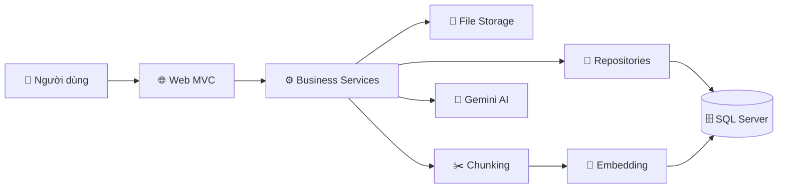
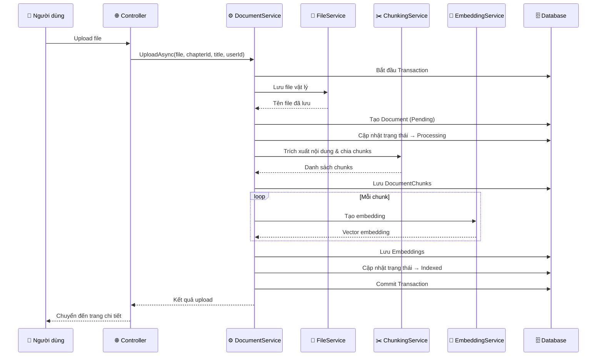
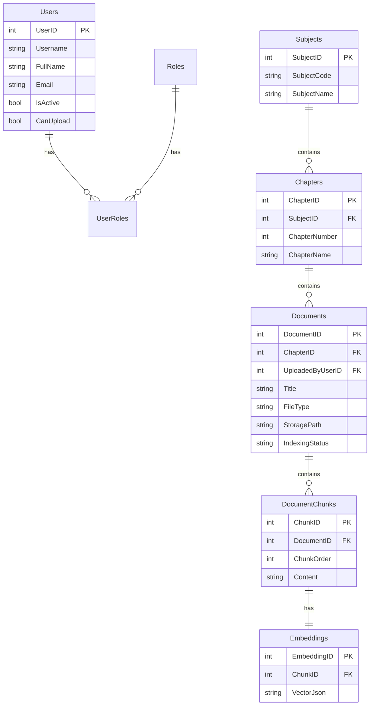

# 📚 Learning Document System

Hệ thống quản lý tài liệu học tập trực tuyến — hỗ trợ upload, phân loại tài liệu theo môn học/chương, trích xuất nội dung, và hỏi đáp AI (Gemini).

---

## 📋 Mục lục

- [Tính năng chính](#-tính-năng-chính)
- [Công nghệ sử dụng](#-công-nghệ-sử-dụng)
- [Cấu trúc dự án](#-cấu-trúc-dự-án)
- [Cài đặt và chạy ứng dụng](#-cài-đặt-và-chạy-ứng-dụng)
- [Tài khoản demo](#-tài-khoản-demo)
- [Hướng dẫn sử dụng](#-hướng-dẫn-sử-dụng)
  - [Đăng nhập / Đăng ký](#1-đăng-nhập--đăng-ký)
  - [Quản lý môn học](#2-quản-lý-môn-học-admin--teacher)
  - [Quản lý chương](#3-quản-lý-chương-admin--teacher)
  - [Upload tài liệu](#4-upload-tài-liệu-admin--teacher)
  - [Xem và tải tài liệu](#5-xem-và-tải-tài-liệu-tất-cả-vai-trò)
  - [Hỏi đáp AI (Chat)](#6-hỏi-đáp-ai-chat-tất-cả-vai-trò)
  - [Quản lý người dùng](#7-quản-lý-người-dùng-admin)
  - [Quản lý Whitelist Email](#8-quản-lý-whitelist-email-admin)
- [Phân quyền](#-phân-quyền)
- [Cấu hình](#-cấu-hình)
- [Kiến trúc hệ thống](#-kiến-trúc-hệ-thống)

---

## ✨ Tính năng chính

| Tính năng | Mô tả |
|---|---|
| 🔐 Đăng nhập / Đăng ký | Xác thực bằng Cookie, phân quyền theo vai trò |
| 📖 Quản lý môn học | Tạo, sửa, xóa môn học (có mã môn + tên môn) |
| 📑 Quản lý chương | Tạo, sửa, xóa chương thuộc từng môn học |
| 📤 Upload tài liệu | Hỗ trợ PDF, DOCX, PPTX — tối đa 50 MB |
| 🔍 Tìm kiếm tài liệu | Lọc theo từ khóa, môn học, chương, trạng thái |
| 📥 Tải tài liệu | Download file gốc về máy |
| 🤖 Hỏi đáp AI | Chat với Gemini AI dựa trên nội dung tài liệu đã upload |
| 👥 Quản lý người dùng | Gán vai trò, tạo tài khoản giảng viên, cấp quyền upload |
| 📧 Whitelist Email | Quản lý danh sách email được phép đăng ký |

---

## 🛠 Công nghệ sử dụng

- **.NET 8** — ASP.NET Core MVC
- **Entity Framework Core 8** — SQL Server
- **Cookie Authentication** — Phân quyền theo Policy
- **AutoMapper** — Mapping Entity ↔ DTO
- **iText7** — Đọc và trích xuất nội dung PDF
- **DocumentFormat.OpenXml** — Đọc DOCX/PPTX
- **Gemini API** — Hỏi đáp AI

---

## 📁 Cấu trúc dự án

```
LearningDocumentSystem/
├── LearningDocumentSystem.Web/          # 🌐 Tầng giao diện (MVC)
│   ├── Controllers/                     #     Xử lý request
│   ├── Views/                           #     Giao diện Razor
│   ├── ViewModels/                      #     Model cho View
│   ├── wwwroot/uploads/                 #     Thư mục lưu file upload
│   └── appsettings.json                 #     Cấu hình ứng dụng
│
├── LearningDocumentSystem.Business/     # ⚙️ Tầng nghiệp vụ
│   ├── Services/                        #     Logic xử lý
│   ├── DTOs/                            #     Data Transfer Objects
│   └── MappingProfiles/                 #     AutoMapper profiles
│
└── LearningDocumentSystem.Data/         # 💾 Tầng dữ liệu
    ├── Entities/                        #     Entity classes
    ├── Repositories/                    #     Repository pattern
    ├── Migrations/                      #     EF Core migrations
    └── LearningDocumentContext.cs       #     DbContext
```

---

## 🚀 Cài đặt và chạy ứng dụng

### Yêu cầu

- [.NET SDK 8](https://dotnet.microsoft.com/download/dotnet/8.0)
- [SQL Server](https://www.microsoft.com/en-us/sql-server/sql-server-downloads) (hoặc SQL Server Express)

### Các bước thực hiện

**Bước 1:** Clone dự án về máy

```bash
git clone <repository-url>
cd Assignment1/LearningDocumentSystem
```

**Bước 2:** Mở file `LearningDocumentSystem.Web/appsettings.json` và cập nhật chuỗi kết nối cho đúng với SQL Server của bạn

```json
{
  "ConnectionStrings": {
    "DefaultConnection": "Server=localhost;Database=LearningDocumentSystemDB;user id=sa;password=<mật_khẩu_của_bạn>;MultipleActiveResultSets=true;TrustServerCertificate=True"
  }
}
```

**Bước 3:** Khôi phục packages và build

```bash
dotnet restore
dotnet build
```

**Bước 4:** Chạy ứng dụng

```bash
dotnet run --project LearningDocumentSystem.Web
```

**Bước 5:** Mở trình duyệt và truy cập URL hiển thị trên terminal (thường là `https://localhost:<port>`)

> [!NOTE]
> Khi chạy lần đầu, ứng dụng sẽ **tự động tạo database**, áp dụng migrations, và seed dữ liệu mẫu (bao gồm tài khoản demo).

---

## 🔑 Tài khoản demo

Ứng dụng đã có sẵn 3 tài khoản demo sau khi seed dữ liệu:

| Vai trò | Email | Mật khẩu |
|---|---|---|
| 🛡️ Admin | `admin@university.edu.vn` | `Admin@123` |
| 👨‍🏫 Teacher | `teacher@university.edu.vn` | `Teacher@123` |
| 🎓 Student | `student@student.edu.vn` | `Student@123` |
---

## 📖 Hướng dẫn sử dụng

### 1. Đăng nhập / Đăng ký

#### Đăng nhập

1. Truy cập trang chủ → Bạn sẽ được chuyển đến trang **Đăng nhập**
2. Nhập **Username** và **Mật khẩu**
3. (Tùy chọn) Tick **Ghi nhớ đăng nhập** để duy trì phiên
4. Nhấn nút **Đăng nhập**

#### Đăng ký tài khoản mới

1. Tại trang Đăng nhập, nhấn **Đăng ký**
2. Nhập **Email** và **Mật khẩu**
3. Nhấn nút **Đăng ký**
4. Sau khi đăng ký thành công → Quay lại trang Đăng nhập để đăng nhập

> [!IMPORTANT]
> Email đăng ký phải nằm trong **danh sách Whitelist** do Admin quản lý. Nếu email chưa được phép, hệ thống sẽ từ chối đăng ký.

---

### 2. Quản lý môn học *(Admin / Teacher)*

#### Xem danh sách môn học

1. Vào menu **Môn học** trên thanh điều hướng
2. Danh sách tất cả môn học sẽ hiển thị (bao gồm mã môn, tên môn, số chương)

#### Tạo môn học mới

1. Nhấn nút **Tạo môn học**
2. Nhập **Mã môn** (ví dụ: `PRN222`) và **Tên môn** (ví dụ: `Lập trình .NET`)
3. Nhấn **Lưu**

#### Sửa môn học

1. Trong danh sách, nhấn nút **Sửa** (biểu tượng ✏️) ở dòng môn học cần sửa
2. Chỉnh sửa thông tin → Nhấn **Lưu**

#### Xóa môn học

1. Nhấn nút **Xóa** (biểu tượng 🗑️) ở dòng môn học cần xóa
2. Xác nhận xóa

> [!WARNING]
> Xóa môn học sẽ ảnh hưởng đến các chương và tài liệu liên quan.

---

### 3. Quản lý chương *(Admin / Teacher)*

#### Xem danh sách chương

1. Vào menu **Chương** trên thanh điều hướng
2. Danh sách chương sẽ hiển thị (kèm thông tin môn học mà chương thuộc về)

#### Tạo chương mới

1. Nhấn nút **Tạo chương**
2. Chọn **Môn học** từ dropdown
3. Nhập **Số thứ tự chương** và **Tên chương**
4. Nhấn **Lưu**

#### Sửa / Xóa chương

- Tương tự như quản lý môn học, sử dụng nút **Sửa** hoặc **Xóa** trên mỗi dòng

---

### 4. Upload tài liệu *(Admin / Teacher)*

1. Vào menu **Tài liệu** → Nhấn nút **Upload tài liệu**
2. Điền thông tin:
   - **Tiêu đề tài liệu**: Đặt tên cho tài liệu
   - **Môn học**: Chọn môn học từ dropdown
   - **Chương**: Chọn chương (danh sách chương sẽ tự động cập nhật khi chọn môn)
   - **Chọn file**: Nhấn chọn file từ máy tính
3. Nhấn **Upload**
4. Hệ thống sẽ xử lý file:
   - Lưu file vật lý vào thư mục `uploads`
   - Trích xuất nội dung văn bản
   - Chia nội dung thành các đoạn nhỏ (chunks)
   - Tạo embedding cho từng đoạn
   - Cập nhật trạng thái thành **Indexed**
5. Sau khi hoàn tất → Chuyển đến trang chi tiết tài liệu

> [!NOTE]
> **Định dạng hỗ trợ:** PDF, DOCX, PPTX  
> **Dung lượng tối đa:** 50 MB

---

### 5. Xem và tải tài liệu *(Tất cả vai trò)*

#### Duyệt danh sách tài liệu

1. Vào menu **Tài liệu**
2. Sử dụng bộ lọc để tìm kiếm:
   - 🔍 **Từ khóa**: Nhập tên tài liệu cần tìm
   - 📖 **Môn học**: Chọn môn học để lọc
   - 📑 **Chương**: Chọn chương (sau khi chọn môn)
   - 📊 **Trạng thái**: Lọc theo `Pending`, `Processing`, `Indexed`, `Failed`
3. Danh sách tài liệu sẽ hiển thị với phân trang

#### Xem chi tiết tài liệu

1. Nhấn vào **tên tài liệu** hoặc nút **Chi tiết** trong danh sách
2. Trang chi tiết hiển thị:
   - Thông tin tài liệu (tiêu đề, môn học, chương, ngày upload, trạng thái)
   - Danh sách các đoạn nội dung đã trích xuất (chunks)

#### Tải tài liệu

1. Tại trang chi tiết tài liệu, nhấn nút **Tải xuống**
2. File gốc sẽ được download về máy tính

#### Xóa tài liệu *(Admin / Teacher)*

1. Tại trang chi tiết hoặc danh sách, nhấn nút **Xóa**
2. Xác nhận xóa → Tài liệu và toàn bộ dữ liệu liên quan sẽ bị xóa

---

### 6. Hỏi đáp AI (Chat) *(Tất cả vai trò)*

1. Vào menu **Chat** trên thanh điều hướng
2. (Tùy chọn) Chọn **Môn học** và **Chương** để giới hạn phạm vi tìm kiếm
3. Nhập câu hỏi vào ô chat
4. Nhấn **Gửi** → Hệ thống sẽ:
   - Tìm kiếm nội dung liên quan trong tài liệu đã upload
   - Gửi câu hỏi kèm ngữ cảnh tới **Gemini AI**
   - Hiển thị câu trả lời

> [!TIP]
> Chọn đúng môn học và chương sẽ giúp AI trả lời chính xác hơn vì phạm vi tìm kiếm được thu hẹp.

---

### 7. Quản lý người dùng *(Admin)*

1. Vào menu **Quản lý người dùng** (chỉ hiển thị với Admin)
2. Tại trang quản lý, Admin có thể:

#### Gán vai trò cho người dùng

- Tick chọn các vai trò (Admin, Teacher, Student) cho từng user
- Nhấn **Cập nhật** để lưu thay đổi

#### Cấp quyền Upload

- Bật/tắt quyền upload cho từng user bằng toggle switch

#### Tạo tài khoản Giảng viên

1. Nhấn nút **Tạo Giảng viên**
2. Nhập Email, Họ tên, Mật khẩu
3. Nhấn **Tạo** → Tài khoản giảng viên mới được tạo với vai trò Teacher

#### Xóa người dùng

- Nhấn nút **Xóa** ở dòng user cần xóa → Xác nhận

---

### 8. Quản lý Whitelist Email *(Admin)*

1. Vào menu **Whitelist** (hoặc từ trang Quản lý người dùng)
2. Tại đây, Admin quản lý danh sách email được phép đăng ký:

#### Thêm email thủ công

- Nhập email vào ô → Nhấn **Thêm**

#### Import email hàng loạt

1. Chuẩn bị file (danh sách email)
2. Nhấn **Import** → Chọn file
3. Hệ thống sẽ đọc và thêm các email mới vào whitelist

#### Xóa email khỏi whitelist

- Nhấn nút **Xóa** bên cạnh email cần gỡ

---

## 🛡 Phân quyền

| Chức năng | Admin | Teacher | Student |
|---|:---:|:---:|:---:|
| Đăng nhập / Đăng ký | ✅ | ✅ | ✅ |
| Xem tài liệu | ✅ | ✅ | ✅ |
| Tải tài liệu | ✅ | ✅ | ✅ |
| Chat AI | ✅ | ✅ | ✅ |
| Upload tài liệu | ✅ | ✅ | ❌ |
| Xóa tài liệu | ✅ | ✅ | ❌ |
| Quản lý môn học | ✅ | ✅ | ❌ |
| Quản lý chương | ✅ | ✅ | ❌ |
| Quản lý người dùng | ✅ | ❌ | ❌ |
| Quản lý Whitelist | ✅ | ❌ | ❌ |

---

## ⚙ Cấu hình

File cấu hình chính: `LearningDocumentSystem.Web/appsettings.json`

| Mục | Key | Giá trị mặc định | Mô tả |
|---|---|---|---|
| Database | `ConnectionStrings:DefaultConnection` | *(local SQL Server)* | Chuỗi kết nối database |
| Upload | `AppSettings:UploadFolder` | `uploads` | Thư mục lưu file |
| Upload | `AppSettings:MaxFileSizeMB` | `50` | Dung lượng tối đa (MB) |
| Upload | `AppSettings:AllowedFileTypes` | `pdf, docx, pptx` | Định dạng file cho phép |
| AI | `Gemini:ApiKey` | *(API key)* | Key xác thực Gemini API |

---

## 🏗 Kiến trúc hệ thống

### Sơ đồ tổng quan



### Luồng xử lý Upload tài liệu



### Thiết kế Database



---

## 📝 Ghi chú

- Thư mục lưu file upload: `LearningDocumentSystem.Web/wwwroot/uploads`
- Cookie bảo mật đang đặt chế độ `None` (phục vụ môi trường development)
- Phiên đăng nhập có hiệu lực trong **8 giờ**

---

## 🔮 Hướng phát triển

- [ ] Tích hợp vector search thực tế (thay thế simulated embedding)
- [ ] Chuyển indexing sang background job (Hangfire / hosted service)
- [ ] Thêm audit logging và monitoring
- [ ] Viết automated tests cho services, repositories, controllers
- [ ] Hỗ trợ thêm định dạng file (Excel, TXT, Markdown...)