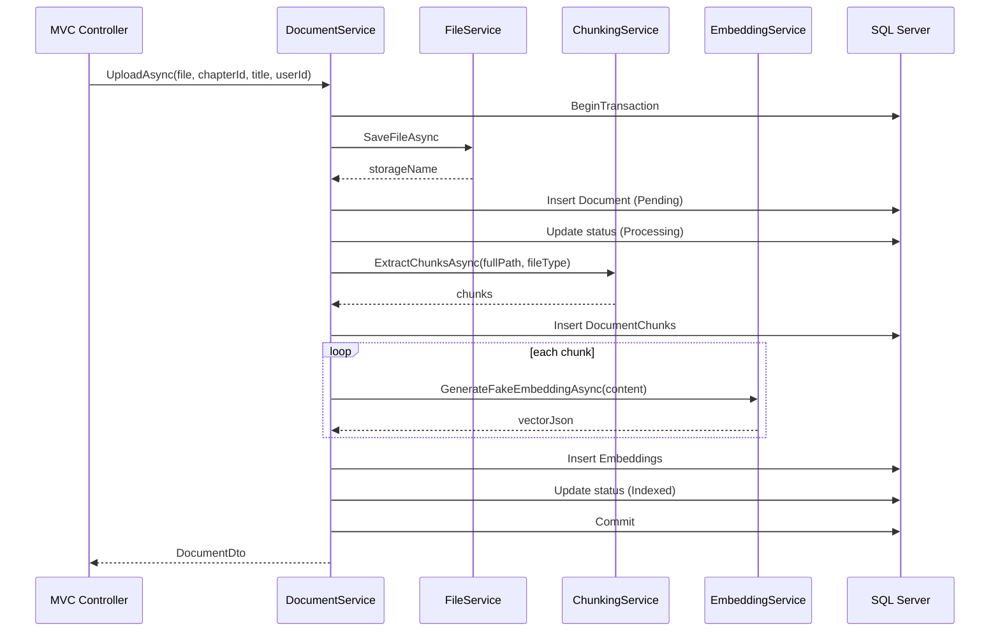

# Learning Document System (Assignment 1)

Hệ thống quản lý tài liệu học tập cho phép tải lên PDF/DOCX/PPTX, chia nhỏ nội dung, và quản lý tài liệu theo chủ đề và chương.

## ⚡ Tính Năng Chính

- 🔐 Xác thực người dùng với 3 vai trò: **Admin**, **Teacher**, **Student**
- 📚 Quản lý môn học (Subject) và chương (Chapter)
- 📤 Tải lên tài liệu (PDF, DOCX, PPTX)
- ✂️ Chia nhỏ nội dung thành chunks
- 🤖 Tạo embedding tương tự vector
- 📊 Theo dõi trạng thái tài liệu: Pending → Processing → Indexed → Failed

---

## 🚀 Cài Đặt Nhanh (Cho Người Mới Bắt Đầu)

### 1️⃣ Yêu Cầu Hệ Thống
- **SQL Server 2019+** (hoặc SQL Server Express)
- **.NET 8 SDK** - tải tại https://dotnet.microsoft.com/download/dotnet/8.0
- **Visual Studio 2022** hoặc **Visual Studio Code** (tuỳ chọn)

### 2️⃣ Bước Setup Đầu Tiên

**A. Tạo Database & Chạy Migration**

```powershell
# Mở PowerShell ở thư mục project
cd "C:\Path\To\Assignment1"

# Cập nhật database
dotnet ef database update --project LearningDocumentSystem.Data --startup-project LearningDocumentSystem.Web
```

**B. Chạy Ứng Dụng**

```powershell
cd LearningDocumentSystem.Web
dotnet run
```

Truy cập: `http://localhost:5000`

---

## 👥 Vai Trò & Quyền Hạn

### 🔑 Admin (Quản Trị Viên)
Admin **CHỈ** quản lý các tài khoản người dùng:
- ✅ Xem danh sách tất cả người dùng
- ✅ Bật/Tắt tài khoản người dùng
- ✅ Tạo tài khoản Giáo viên mới
- ✅ Quản lý danh sách email được phép đăng ký (whitelist)
- ✅ Cấp/Thu hồi quyền upload cho Giáo viên

**Admin KHÔNG quản lý:**
- ❌ Tạo/Xóa môn học (Subject)
- ❌ Tạo/Xóa chương (Chapter)
- ❌ Tải/Xóa tài liệu (Document)

### 📖 Teacher (Giáo Viên)
- ✅ Xem danh sách môn học
- ✅ Tạo chương mới (với quyền của Admin)
- ✅ Tạo/Xóa tài liệu (PDF, DOCX, PPTX)
- ✅ Xem trạng thái xử lý tài liệu

### 👤 Student (Sinh Viên)
- ✅ Xem danh sách môn học
- ✅ Xem danh sách chương
- ✅ Xem tài liệu và nội dung
- ✅ Chat với AI về nội dung (nếu có)

---

## ⚙️ Cấu Hình (Configuration)

### 📋 Tệp: `LearningDocumentSystem.Web/appsettings.json`

File này chứa toàn bộ cấu hình hệ thống. Bạn cần chỉnh sửa theo thông tin của mình:

```json
{
  "ConnectionStrings": {
    "DefaultConnection": "Server=YOUR_SERVER;Database=LearningDocumentSystemDB;user id=YOUR_USERNAME;password=YOUR_PASSWORD;MultipleActiveResultSets=true;TrustServerCertificate=True"
  },
  "AppSettings": {
    "UploadFolder": "uploads",
    "MaxFileSizeMB": 50,
    "AllowedFileTypes": ["pdf", "docx", "pptx"]
  },
  "Gemini": {
    "ApiKey": "YOUR_GEMINI_API_KEY",
    "ModelName": "gemini-3.1-flash-lite"
  },
  "Logging": {
    "LogLevel": {
      "Default": "Information",
      "Microsoft.AspNetCore": "Warning",
      "Microsoft.EntityFrameworkCore": "Warning"
    }
  },
  "AllowedHosts": "*"
}
```

### 🔑 Các Tham Số Cần Thay Đổi

| Tham Số | Ví Dụ | Mô Tả |
|--------|-------|-------|
| `YOUR_SERVER` | `localhost` hoặc `(localdb)\mssqllocaldb` | Tên/địa chỉ SQL Server |
| `YOUR_USERNAME` | `sa` hoặc username SQL Server của bạn | Username để login SQL |
| `YOUR_PASSWORD` | Mật khẩu SQL Server của bạn | Password để login SQL |
| `YOUR_GEMINI_API_KEY` | Lấy từ https://aistudio.google.com/ | API key Google Gemini (optional) |

⚠️ **LƯU Ý:**
- Đó CHỈ là **ví dụ**. Bạn phải thay bằng **thông tin thực tế của mình**
- Không chia sẻ `appsettings.json` có chứa mật khẩu trên GitHub
- Nếu không có Gemini, bỏ qua phần `Gemini` hoặc dùng API key rỗng

---

## 📖 Hướng Dẫn Sử Dụng Từng Vai Trò

### 1. Admin - Quản Lý Tài Khoản

**Truy cập:** Menu Admin → Quản Lý Người Dùng

**Chức Năng:**
- **Xem Danh Sách:** Tất cả người dùng với vai trò hiện tại
- **Bật/Tắt Tài Khoản:** Click checkbox "Active"
- **Cấp Quyền Upload:** Toggle "Cho phép upload" cho Giáo viên
- **Tạo Tài Khoản Giáo Viên:** Form "Tạo Giáo Viên Mới"
- **Quản Lý Whitelist:** Menu "Danh Sách Email Cho Phép" để quản lý email đăng ký

### 2. Teacher - Quản Lý Nội Dung

**Các Bước:**
1. Chọn Môn Học → Chọn Chương
2. Nhấn "Tải Lên Tài Liệu"
3. Chọn file (PDF/DOCX/PPTX)
4. Hệ thống tự động:
   - Trích xuất nội dung
   - Chia thành chunks
   - Tạo embeddings
   - Cập nhật trạng thái

### 3. Student - Học Tập

1. Chọn Môn Học
2. Xem danh sách Chương
3. Đọc Tài Liệu
4. Sử dụng Chat AI (nếu có)

---

## 🏗️ Kiến Trúc Hệ Thống (System Architecture)

```
┌─────────────────────────────────────────────────────┐
│         📱 PRESENTATION LAYER (Web)                 │
│  ┌──────────┬──────────────┬──────────┐              │
│  │ Models   │ Controllers  │ Views    │              │
│  └──────────┼──────────────┼──────────┘              │
│             │ViewModels     │                        │
│             └───────────────┘                        │
└────────────────────┬────────────────────────────────┘
                     │ Request/Response
                     ▼
┌─────────────────────────────────────────────────────┐
│         💼 BUSINESS LOGIC LAYER (Business)          │
│  ┌─────────────┬──────────┬────────┐               │
│  │  Services   │ Mapping  │ DTOs   │               │
│  └─────────────┴──────────┴────────┘               │
│  - AuthService                                      │
│  - DocumentService (Upload/Chunking)               │
│  - EmbeddingService (AI)                           │
│  - ChatService                                      │
└────────────────────┬────────────────────────────────┘
                     │
          ┌──────────┴──────────┐
          ▼                     ▼
┌─────────────────────┐  ┌──────────────────────┐
│  🗄️ DATA LAYER      │  │ 🔌 EXTERNAL SERVICE │
│  - UnitOfWork       │  │ - Google Gemini API│
│  - Repositories     │  │ - File Storage     │
│  - DbContexts       │  └──────────────────────┘
│  - Entities         │
│  - Helpers          │
└────────┬────────────┘
         │
         ▼
    ┌─────────────┐
    │ 💾 SQL      │
    │ SERVER      │
    │ DATABASE    │
    └─────────────┘
```

---

## 🔄 Quy Trình Upload & Xử Lý Tài Liệu

```
1. Tải Lên File
   ↓
2. Validate (loại file, kích thước)
   ↓
3. Lưu File (wwwroot/uploads)
   ↓
4. Tạo Document Record (Status = Pending)
   ↓
5. Trích Xuất Text
   ├─ PDF: iText7
   ├─ DOCX: OpenXml
   └─ PPTX: OpenXml
   ↓
6. Chia Thành Chunks (đoạn nhỏ)
   ↓
7. Tạo Embeddings (biểu diễn vector)
   ↓
8. Lưu Vào Database
   ├─ Document chunks
   └─ Embeddings
   ↓
9. Cập Nhật Status = Indexed ✅
```

---

## 📦 Công Nghệ Sử Dụng

| Thành Phần | Công Nghệ |
|-----------|----------|
| **Framework** | .NET 8, ASP.NET Core MVC |
| **Database** | SQL Server 2019+ |
| **ORM** | Entity Framework Core 8 |
| **Authentication** | Cookie Authentication |
| **Mapping** | AutoMapper |
| **PDF Parsing** | iText7 |
| **Office Files** | DocumentFormat.OpenXml |
| **AI** | Google Gemini API |

---

## 🛠️ Khắc Phục Sự Cố (Troubleshooting)

### ❌ Lỗi: "Cannot connect to database"
**Giải Pháp:**
- Kiểm tra SQL Server đang chạy: `sqlcmd -S localhost -U sa`
- Cập nhật `ConnectionString` trong `appsettings.json`
- Kiểm tra mật khẩu SQL Server

### ❌ Lỗi: "File upload failed"
**Giải Pháp:**
- Kiểm tra thư mục `wwwroot/uploads/` tồn tại
- Kiểm tra quyền write trên folder
- Kiểm tra kích thước file < 50MB

### ❌ Lỗi: "Unauthorized" khi upload
**Giải Pháp:**
- Đăng nhập lại
- Kiểm tra Admin đã cấp quyền upload cho tài khoản Teacher?

---

## 📞 Hỗ Trợ Thêm

Nếu gặp vấn đề, kiểm tra:
1. **Log file:** `bin/Debug/` hoặc Output window
2. **Database:** Xem dữ liệu bằng SQL Management Studio
3. **Network:** Đảm bảo port 5000 không bị block

---

## 📋 Sequence Diagram



## 💾 Thiết Kế Database

Các bảng chính:
- `Users`: Người dùng hệ thống
- `Roles`: Các vai trò (Admin, Teacher, Student)
- `UserRoles`: Quan hệ nhiều-nhiều giữa Users và Roles
- `Subjects`: Các môn học
- `Chapters`: Các chương
- `Documents`: Tài liệu tải lên
- `DocumentChunks`: Các đoạn của tài liệu
- `Embeddings`: Vector biểu diễn cho mỗi chunk

**Quan hệ:**
- `Subject` (1) ↔ (n) `Chapter`
- `Chapter` (1) ↔ (n) `Document`
- `Document` (1) ↔ (n) `DocumentChunk`
- `DocumentChunk` (1) ↔ (1) `Embedding`
- `User` (n) ↔ (n) `Role` (qua `UserRoles`)

---

## 🔒 Mô Hình Authorization (Cập Nhật)

| Policy | Ai được phép | Ghi chú |
|--------|-------------|--------|
| **AdminOnly** | Admin | Quản lý tài khoản người dùng |
| **TeacherUp** | Teacher (có CanUpload=True) | Tải lên & quản lý tài liệu |
| **TeacherOrStudent** | Teacher, Student | Xem/tương tác nội dung |
| **AllUsers** | Bất kỳ người dùng authenticated | Truy cập cơ bản |

**Admin không thể:**
- Tạo/xóa Subject
- Tạo/xóa Chapter
- Tải lên/xóa Document

---

## 📚 Tài Khoản Demo Mặc Định (Seeded Data)

⚠️ **QUAN TRỌNG:** Đây là tài khoản **mặc định để test**. Bạn **PHẢI ĐỔI NGAY** sau lần đăng nhập đầu tiên!

Khi chạy lần đầu, hệ thống tự động tạo 3 tài khoản test:

| Vai Trò | Username | Password Mặc Định | Hành Động |
|--------|----------|-------------------|----------|
| Admin | `admin@university.edu.vn` | `Admin@123` | ⚠️ ĐỔI NGAY |
| Teacher | `teacher@university.edu.vn` | `Teacher@123` | ⚠️ ĐỔI NGAY |
| Student | `student@student.edu.vn` | `Student@123` | ⚠️ ĐỔI NGAY |

**Hướng dẫn:**
1. Đăng nhập với một trong các tài khoản trên
2. Vào cài đặt tài khoản → Đổi mật khẩu
3. Tạo mật khẩu mới (mạnh, ghi nhớ)
4. Lặp lại với 3 tài khoản

💡 **Mẹo:** Có thể xoá tài khoản demo sau khi test xong (Admin → Quản Lý Người Dùng → Xóa)

---

## 🚀 Chạy Ứng Dụng (Chi Tiết)

### Bước 1: Restore Dependencies
```bash
cd LearningDocumentSystem
dotnet restore
```

### Bước 2: Build Solution
```bash
dotnet build
```

### Bước 3: Cập Nhật Database
```bash
dotnet ef database update --project LearningDocumentSystem.Data --startup-project LearningDocumentSystem.Web
```

### Bước 4: Chạy Web Project
```bash
dotnet run --project LearningDocumentSystem.Web
```

Truy cập: `http://localhost:5000` (hoặc URL được hiển thị trong console)

---

## 📝 Ghi Chú Hoạt Động

- **Thư mục upload:** `LearningDocumentSystem.Web/wwwroot/uploads/`
- **Giới hạn file:** 50 MB
- **Cookie security:** Được đặt thành `None` cho development
- **Embeddings:** Hiện tại là giả lập (demo flow)

---
